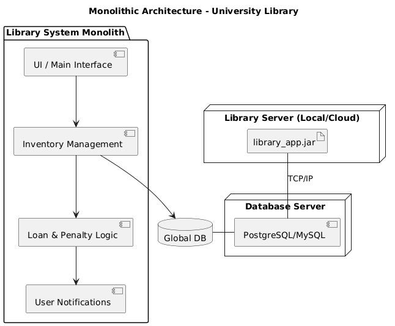
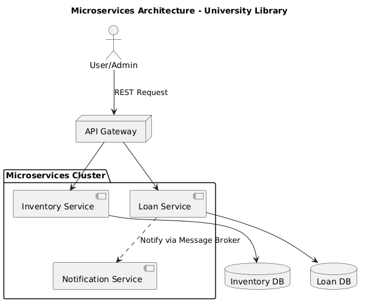
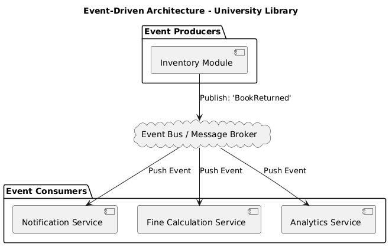

# Software Architecture Analysis - University Library System

This document provides a detailed investigation and evaluation of three different architectural styles for the University Library Management System.

---

## 1. Monolithic Architecture

### Description
In this architectural style, the entire application is built as a single, unified unit. All the components we implemented in Milestone 2—such as the **LibraryInventory** (Singleton), **MaterialFactory** (Factory), and the notification and penalty logic—reside within the same codebase and run as a single process. 

Communication between components happens through direct method calls in the Java Virtual Machine (JVM). Data is stored in a single, centralized database, and the user interface (CLI or GUI) is bundled together with the business logic.

### Architectural Diagrams

#### Component and Deployment View
The following diagram illustrates how the components are integrated within a single execution unit and deployed on a server.

### Pros and Cons

| Pros | Cons |
| :--- | :--- |
| **Simplicity:** Easier to develop, test, and debug since everything is in one place. | **Scaling Issues:** You cannot scale specific parts (e.g., just the notification service) independently; you must scale the whole app. |
| **Performance:** Low latency because there is no network overhead between components. | **Low Fault Tolerance:** If a bug crashes the penalty logic, the entire library system goes offline. |
| **Deployment:** Simple deployment process (usually a single JAR file). | **Technology Lock-in:** The entire system must use the same technology stack (Java). |

### Relevance to the Project
The current state of our University Library project follows this style. It is highly effective for the current proof-of-concept scope, as it allows for rapid development and straightforward implementation of design patterns without the complexity of network communication.

## 2. Microservices Architecture

### Description
In this architecture, the Library System is decomposed into small, independent services that communicate over a network (typically via REST APIs or Message Brokers). Each service manages its own logic and database, ensuring loose coupling.

For our project, the system would be split into:
- **Inventory Service:** Handles the creation (Factory) and storage of materials.
- **Loan & Penalty Service:** Manages the borrowing logic and calculates fines using the Strategy pattern.
- **Notification Service:** A dedicated service for the Observer logic to alert users.

### Architectural Diagrams

#### Component and Interaction View
The diagram below shows the decentralized nature of the services, the API Gateway, and the independent databases.

[Image of microservices software architecture diagram]

### Pros and Cons

| Pros | Cons |
| :--- | :--- |
| **Independent Scalability:** Each service (e.g., Notifications) can be scaled based on its specific demand. | **High Complexity:** Significant overhead in managing network communication, service discovery, and deployment. |
| **Fault Isolation:** If the Penalty service fails, users can still browse the inventory. | **Data Consistency:** Managing distributed transactions across multiple databases is difficult. |
| **Technology Diversity:** Different services can be written in different languages if needed. | **Latency:** Network calls between services are slower than local method calls. |

### Relevance to the Project
While overkill for a simple library, this architecture would be ideal for a real-world University system serving thousands of campuses. It allows the Inventory and Loan services to evolve independently without redeploying the whole system.

## 3. Event-Driven Architecture (EDA)

### Description
In an Event-Driven Architecture, the system's components react to state changes, known as "events." Instead of services calling each other directly, they communicate asynchronously through an **Event Bus** or **Message Broker**.

For our Library System, this translates perfectly to our **Observer pattern** logic:
- When a book is returned, the **Inventory Module** publishes a `BookReturned` event.
- The **Notification Service** (the Observer) listens for this event and alerts students.
- Simultaneously, the **Fine Service** and **Analytics Service** can consume the same event to calculate penalties or update library statistics without the Inventory Module knowing they exist.

### Architectural Diagrams

#### Event Flow View
The following diagram shows how the Event Bus acts as a mediator between the producer and multiple independent consumers.

### Pros and Cons

| Pros | Cons |
| :--- | :--- |
| **Extreme Decoupling:** The producer (Inventory) doesn't need to know who is listening to the events. | **Tracing Difficulty:** It can be hard to track the flow of a specific transaction across many asynchronous events. |
| **High Responsiveness:** Multiple services can react to the same event simultaneously. | **Broker Dependency:** If the Message Broker goes down, communication between services is lost. |
| **Extensibility:** Adding a new feature (like an Analytics service) is easy; just make it listen to existing events. | **Complexity:** Requires specialized infrastructure (like RabbitMQ or Apache Kafka). |

### Relevance to the Project
This architecture is the natural evolution of our **Observer Pattern**. It provides a professional way to handle notifications and secondary tasks (like fine calculation) without bloating the main inventory logic.

---

## 4. Final Comparison and Selection

### Comparative Analysis

| Feature | Monolithic | Microservices | Event-Driven |
| :--- | :--- | :--- | :--- |
| **Complexity** | Low | High | Medium-High |
| **Scalability** | Limited | High | Very High |
| **Development Speed** | Fast (Initial) | Slow | Medium |
| **Deployment** | Simple | Complex | Complex |
| **Maintenance** | Harder as it grows | Easier (Per service) | Flexible |

### Selected Architecture: Monolithic Architecture

For the current scope of the **University Library Management System**, I have selected the **Monolithic Architecture** as the most suitable choice.

#### Justification:
1. **Scope Alignment:** Our project is a proof-of-concept focused on the implementation of Design Patterns (Singleton, Factory, Observer, Strategy). A monolithic structure allows these patterns to interact directly in memory, which is the most efficient way to demonstrate their logic without the overhead of network configuration.
2. **Resource Efficiency:** As a university project, the Monolith requires fewer resources to run, test, and deploy. It avoids the "distributed monolith" trap where complexity increases without a real need for independent scaling.
3. **Operational Simplicity:** The current requirements do not justify the operational costs of managing a service mesh or a message broker. The simplicity of a single codebase ensures that the focus remains on high-quality object-oriented design.

#### Conclusion:
While **Microservices** and **Event-Driven** styles offer superior scalability and fault isolation for global systems, the **Monolithic style** provides the necessary balance of performance and simplicity for this educational stage, ensuring a robust and maintainable system.