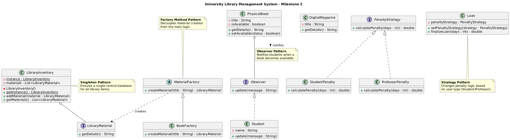

# Project Design - University Library Management System

This document details the architectural decisions and design patterns implemented in the project.

## UML Class Diagram

Below is the integrated class diagram showing the core structure and how the design patterns interact.

### Implemented Design Patterns

1. **Singleton (LibraryInventory):** - Ensures only one global instance of the library catalog exists.
   - Prevents data inconsistency across different modules.

2. **Factory Method (MaterialFactory):**
   - Encapsulates the instantiation of different materials (`PhysicalBook`, `DigitalMagazine`).
   - Allows adding new material types without modifying existing client code.

3. **Observer (User/Book):**
   - Implements a notification system. 
   - Students (Observers) are notified when a `PhysicalBook` (Subject) changes its status to available.

4. **Strategy (PenaltyStrategy):**
   - Defines a family of algorithms for fine calculation.
   - Allows switching between `StudentPenalty` and `ProfessorPenalty` at runtime.